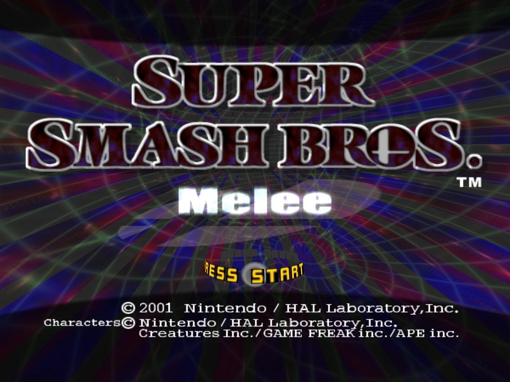
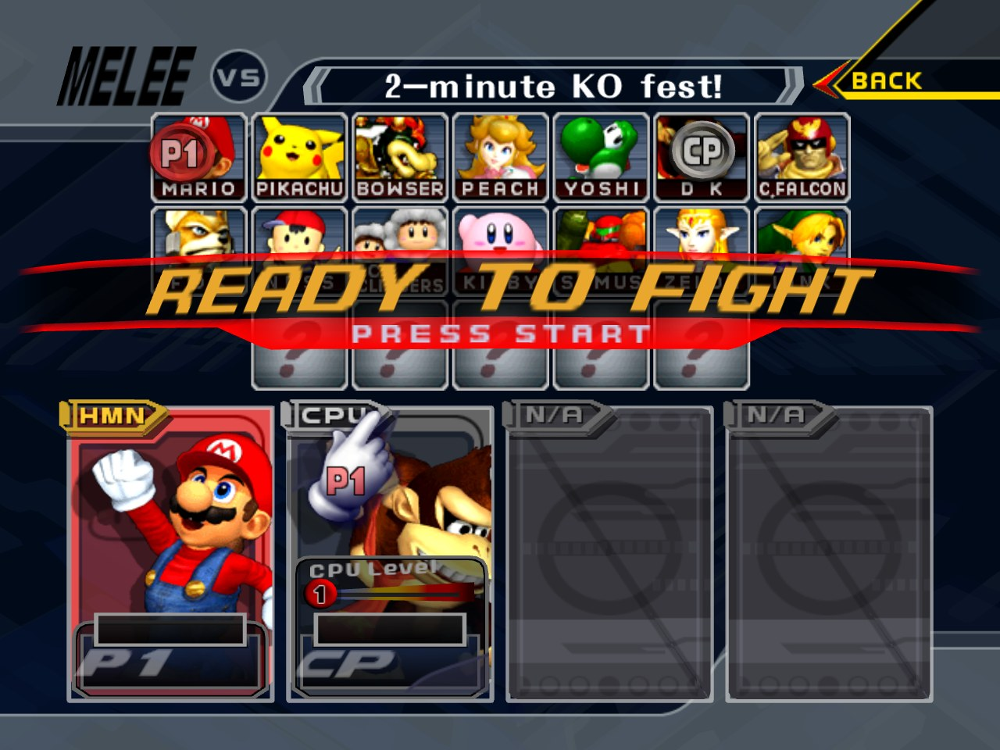
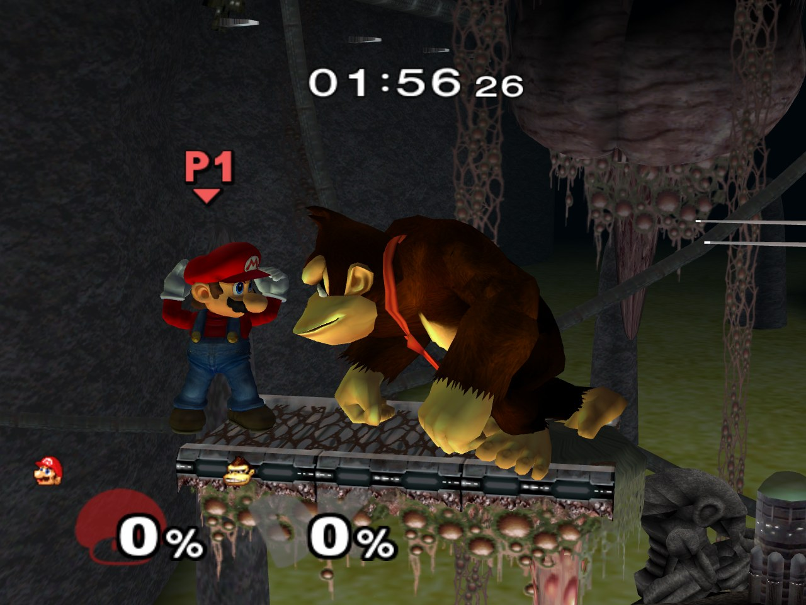
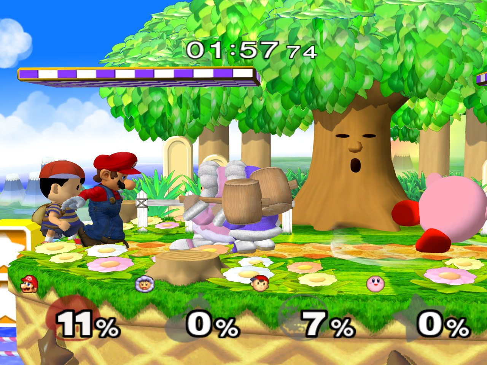
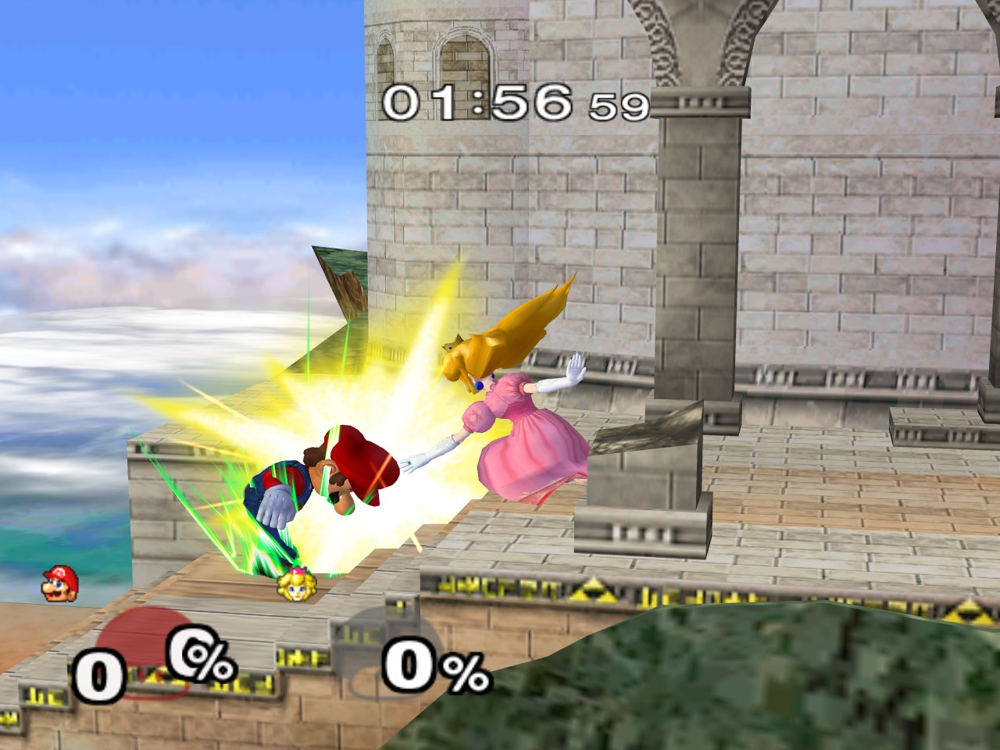
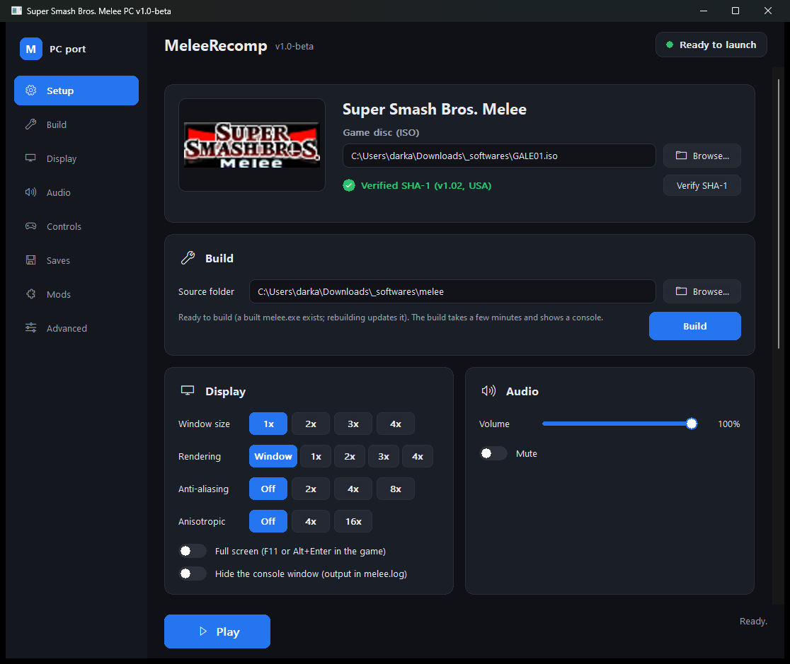

# About this fork: MeleeRecomp

This repository is a copy of [doldecomp/melee](https://github.com/doldecomp/melee)
with one addition: **MeleeRecomp**, a native Windows port of the game built
from the decompiled sources. No emulator: the game's own code, compiled for
x86, with the console's SDK replaced by a small runtime (disc access, an
OpenGL renderer for the GX graphics API, a software audio mixer, video
decoding, memory cards, controllers, the window).

<table>
  <tr>
    <td></td>
    <td></td>
  </tr>
  <tr>
    <td></td>
    <td></td>
  </tr>
  <tr>
    <td></td>
    <td></td>
  </tr>
</table>

*Rendered at 2x the console's resolution with 4x anti-aliasing; the last
picture is the launcher.*

The port lives in the [`pc/`](../pc) directory and is documented in
[`pc/README.md`](../pc/README.md). What it does today:

- **Plays the game natively**: the menus, the character and stage select,
  VS matches with every stage, fighter, item and hazard, Classic,
  Adventure's first stage, Event Match, Target Test, Home-Run Contest,
  Multi-Man Melee and Training, the trophy and records screens, the intro
  and other movies.
- **Resolution scaling**: the game renders at 1x to 8x its 640x480 (or at
  the window's size), with multisample anti-aliasing and anisotropic
  filtering, in a resizable window or full screen; the console's own look
  is one setting away.
- **Sound**: every sound effect and music stream through a software mixer,
  including the console's reverb and delay effects.
- **Saves you can carry around**: the memory card is a raw card image in
  the format Dolphin uses, with the data in the console's byte order, so
  a save moves between MeleeRecomp, Dolphin and a real GameCube without
  conversion, and `.gci` files import.
- **Controllers**: the official GameCube controller adapter (Nintendo's and
  the compatible ones, over WinUSB; the launcher installs the driver and
  shows the adapter's state), XInput gamepads on ports 1-4, or the
  keyboard on port 1 with a remappable layout.
- **A launcher**, [`pc/dist/melee-launcher.exe`](../pc/dist), committed
  ready to run. It verifies your disc image (SHA-1 against the v1.02 disc),
  builds the game from this checkout with your own disc, sets the window
  size, rendering resolution, anti-aliasing, full screen, volume, keyboard
  layout and save folder, extracts the disc's files, manages mods, and
  starts the game.
- **Mods**: a folder of replacement files in the disc's own layout, enabled
  from the launcher or `mods\enabled.txt`; the extracted disc is the
  starting point.
- **Performance**: vertices are transformed and lit on the GPU and draws
  are batched, so a four-player match takes a few milliseconds a frame on
  an ordinary machine.

## Getting started

1. Install [Visual Studio](https://visualstudio.microsoft.com/) (Community
   is free) with "Desktop development with C++" and the "C++ Clang tools for
   Windows" component.
2. Clone this repository.
3. Run `pc\dist\melee-launcher.exe`. Point "Game disc" at your own Super
   Smash Bros. Melee (USA) v1.02 disc image and click "Verify SHA-1".
   The port targets exactly the executable the
   [doldecomp/melee](https://github.com/doldecomp/melee) decompilation
   matches, GALE01 revision 2 (NTSC 1.02), whose `main.dol` has the SHA-1
   `08e0bf20134dfcb260699671004527b2d6bb1a45` (the same hash upstream's
   README asks for). The launcher checks that hash, and the whole disc
   image against `d4e70c064cc714ba8400a849cf299dbd1aa326fc`; the game
   checks `main.dol` again when it starts and refuses any other revision.
4. Click "Build" in the launcher's Build card (or run `pc\build.cmd`). A
   console shows the build; the first one takes a few minutes. The
   GameCube build described below is not needed.
5. Click Play. `Escape` quits, `F11` toggles full screen.

To use a controller, plug a GameCube controller adapter in and click
"Adapter setup..." on the Controls card once (it installs the WinUSB
driver); XInput gamepads and the keyboard need no setup. To keep playing
a Dolphin save, copy Dolphin's `MemoryCardA.USA.raw` (from its
`GC\USA\Card A` folder) into the saves folder shown on the Saves card, or
drop a `.gci` file there; copy the file back to carry your progress to
Dolphin.

The game executable is never distributed: it embeds tables taken from
the disc's `main.dol`, so each copy is built from its owner's disc. The
repository contains no game data. Other revisions of the game (1.00, 1.01,
PAL, Japanese) have different data layouts and are not supported.

## How the port is built

- The game and engine sources in `src/` are shared with the GameCube build
  and stay byte-for-byte compatible with it; PC-specific code sits behind
  `TARGET_PC`, and the PC runtime (`pc/src/`) replaces the console's SDK:
  disc access, the GX renderer on OpenGL, the AX audio mixer, THP video,
  memory cards, controllers, the window.
- `pc/build.cmd` produces `build/pc/melee.exe`, a 32-bit Windows binary
  that reads its files straight from the disc image, plus the launcher and
  a build-time tool that pulls the font tables out of the disc.
- `pc/README.md` has the full story: status by milestone, every option,
  what the renderer and the mixer cover, the debugging aids, the changes
  made to shared sources and the known gaps.
